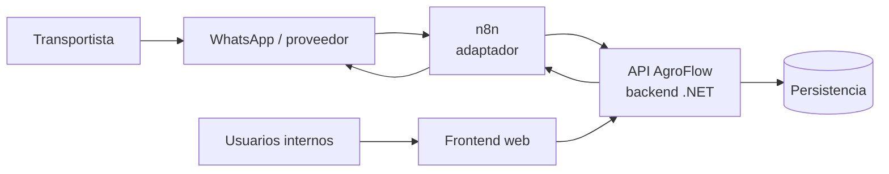

# Contexto del sistema

## Propósito

Este documento ubica a AgroFlow dentro de su entorno y fija los límites de responsabilidad entre sus partes. Describe la arquitectura prevista para el MVP sin reemplazar las especificaciones funcionales de OpenSpec ni el contrato de la API.

## Problema que resuelve

AgroFlow coordina la asignación y el seguimiento de turnos para el ingreso de camiones a un ingenio durante la zafra. Busca reducir la llegada desordenada, las esperas y la pérdida de calidad asociada, manteniendo una operación trazable y aislada por ingenio.

## Personas y sistemas relacionados

| Actor o sistema | Relación con AgroFlow |
|---|---|
| Transportista | Solicita y consulta turnos e informa `EN_CAMINO` mediante WhatsApp/n8n. La cancelación por ese canal no es obligatoria en el MVP. |
| Operador | Gestiona los tres catálogos, crea y cancela turnos de su ingenio desde la interfaz interna y ejecuta las transiciones operativas autorizadas. |
| Supervisor o gerente | El supervisor puede gestionar los tres catálogos y crear o cancelar turnos de su ingenio; el gerente monitorea según los permisos que aún deben completarse. |
| Administrador autorizado | Mantiene accesos según la matriz de permisos que se apruebe; no sustituye los permisos ya confirmados para operador y supervisor. |
| WhatsApp y su proveedor | Canal externo de mensajería. El proveedor y sus detalles técnicos todavía deben definirse. |
| n8n | Adaptador entre el canal de mensajería y la API. Normaliza solicitudes y presenta respuestas; no decide reglas de negocio. |
| Repositorio de datos | Conserva el estado operativo, las relaciones del dominio y la trazabilidad. La base técnica actual utiliza Entity Framework Core y SQL Server. |

## Contenedores principales

### Frontend web

- Presenta el dashboard y los flujos para usuarios internos.
- Consume contratos publicados por la API.
- Puede validar formato y mejorar la experiencia, pero no replica decisiones de asignación, prioridad, capacidad, autorización o transición de estados.
- Debe tratar la respuesta del backend como el estado vigente de la operación.

### Backend .NET

- Expone la API de AgroFlow.
- Autentica y autoriza las operaciones internas.
- Aplica las reglas del dominio y valida las transiciones.
- Persiste el estado antes de confirmar una operación.
- Aísla los datos por ingenio y genera la trazabilidad requerida.
- Es la fuente operativa de verdad; esta decisión se desarrolla en [ADR-003](decisions/ADR-003-backend-fuente-de-verdad.md).

La solución actual es una base reutilizada y todavía contiene nombres y modelos del proyecto anterior. Su estructura no representa por sí misma el modelo final de AgroFlow.

### n8n

- Recibe y normaliza mensajes del canal externo.
- Invoca casos de uso publicados por la API.
- Transforma respuestas de la API a mensajes comprensibles para el transportista.
- Ejecuta reintentos y correlación únicamente según contratos acordados.
- No calcula prioridad, capacidad, ventanas ni transiciones de estado.
- No mantiene una copia autoritativa del turno.

### Persistencia

- Conserva el estado que el backend considera confirmado.
- Debe soportar relaciones, auditoría y aislamiento por ingenio.
- El diseño físico, la estrategia de migraciones y la operación de ambientes se documentarán al tomar esas decisiones.

## Flujos de alto nivel

### Usuario interno

1. El usuario se autentica desde el frontend.
2. El frontend envía una solicitud a la API.
3. El backend valida identidad, permisos, ingenio y reglas del caso de uso.
4. El backend persiste el cambio y devuelve el resultado vigente.
5. El frontend actualiza su presentación con esa respuesta.

### Transportista por mensajería

1. El transportista envía un mensaje por el canal configurado.
2. n8n identifica la intención y reúne los datos exigidos por el contrato.
3. n8n invoca la API con identidad, contexto y correlación suficientes.
4. El backend valida, decide y persiste la operación.
5. n8n presenta la respuesta del backend sin reinterpretar la regla de negocio.

La autenticación del canal, la deduplicación y los reintentos deben quedar cerrados para el ambiente de demostración antes de implementar su integración. Un proveedor de pruebas o adaptador reproducible puede emular el límite de WhatsApp; n8n y la API real siguen siendo parte del recorrido.

## Capacidades dentro del límite

- acceso y autorización;
- datos maestros de transportistas, camiones y fincas;
- solicitud, asignación, consulta, actualización y cancelación de turnos;
- registro de interrupciones operativas y tratamiento de turnos afectados;
- monitoreo operativo y dashboard;
- integración de mensajería mediante n8n;
- auditoría, aislamiento por ingenio y requisitos de plataforma.

El alcance detallado y los casos de uso trazables se encuentran en [visión y alcance](../product/vision-and-scope.md) y [catálogo de casos de uso](../product/use-case-catalog.md).

## Límites y principios

1. Una regla compartida se especifica una sola vez, por capacidad del negocio.
2. El frontend y n8n son consumidores del backend, no fuentes alternativas de estado.
3. Ninguna confirmación se comunica antes de que el backend haya aceptado y persistido la operación.
4. La pertenencia a un ingenio debe verificarse en el backend, no solo filtrarse en la interfaz.
5. Toda decisión todavía no acordada se registra en [decisiones abiertas](../planning/open-decisions.md) y no se convierte accidentalmente en comportamiento por defecto.

## Vistas pendientes

Este contexto se complementará, cuando existan decisiones aprobadas, con:

- vista de contenedores y componentes;
- modelo de despliegue por ambiente;
- diagrama de datos y límites de agregados;
- secuencias para los casos de uso críticos;
- modelo de amenazas e integraciones.
